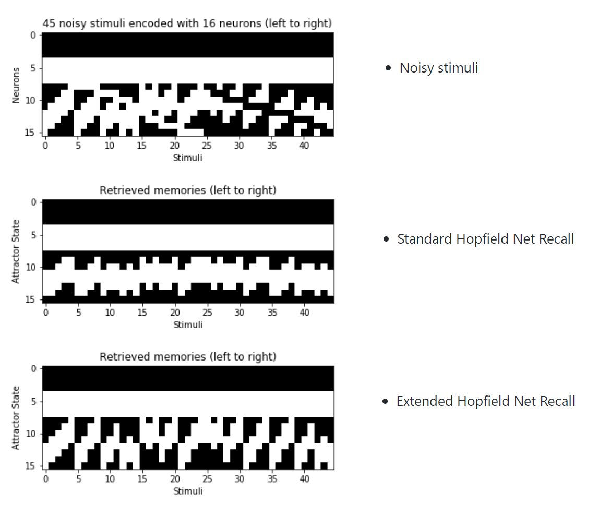
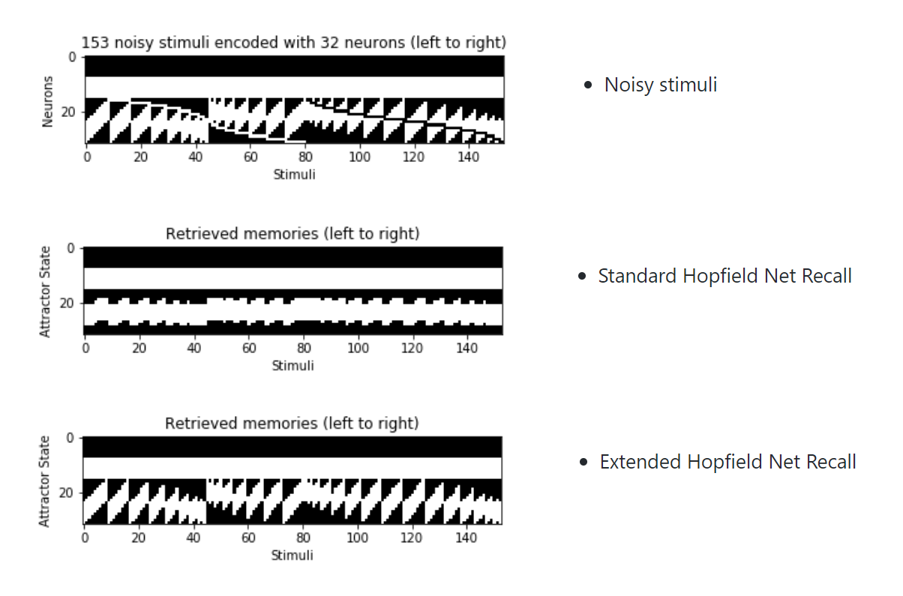
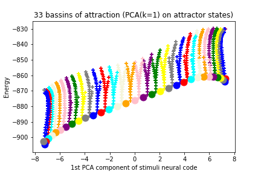
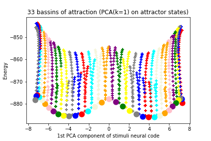

# Novelty-Facilitated Synaptic Plasticity

## Overview

Python implementation of [Dynamics of memory representations in networks with novelty-facilitated synaptic plasticity](https://www.sciencedirect.com/science/article/pii/S0896627306006386)

The model consists in an extended Hopfield Network with a Novelty Signal to store in and retrieve from memory morphed patterns.

## Requirements

- [Python](https://anaconda.org/anaconda/python)
- [Jupyter](http://jupyter.org/)

## Denoising task

### Morph sequence: p=5 patterns (on 16 neurons)

### Morph sequence: p=9 patterns (on 32 neurons)

### Morph sequence: p=33 patterns (on 128 neurons)

- Extended Hopfield Net Bassins of Attraction (gradual learning protocol)

- Extended Hopfield Net Bassins of Attraction (mixed learning protocol)

## Acknowledgments

Special thanks to [Pr. Jean-Pierre Nadal](http://www.lps.ens.fr/~nadal/) (École Normale Supérieure) for his course on Computational Neuroscience at ENS Cachan (M2 MVA).

## Author

Michel Deudon / [@mdeudon](https://github.com/MichelDeudon)
